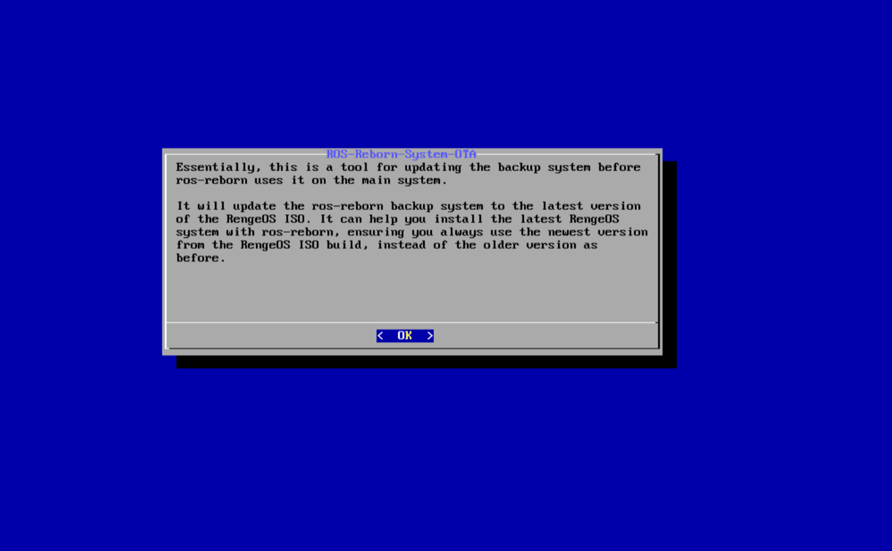
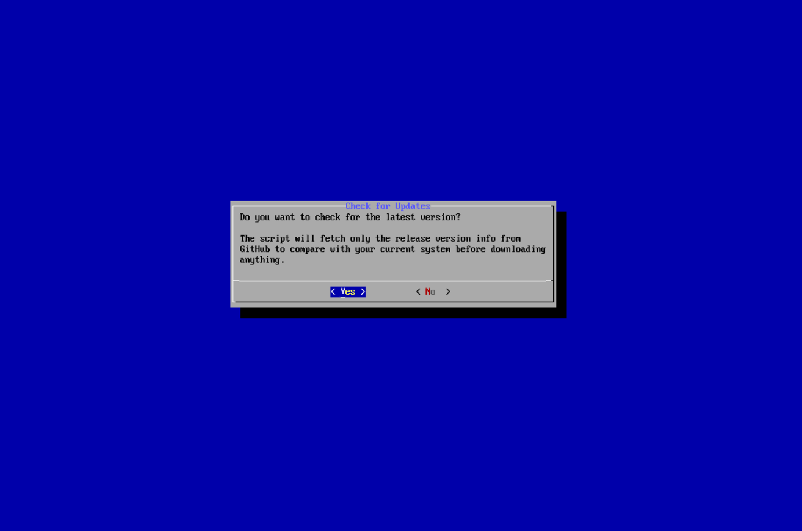
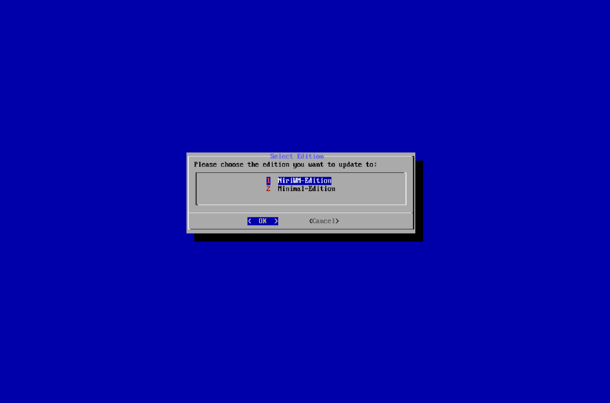
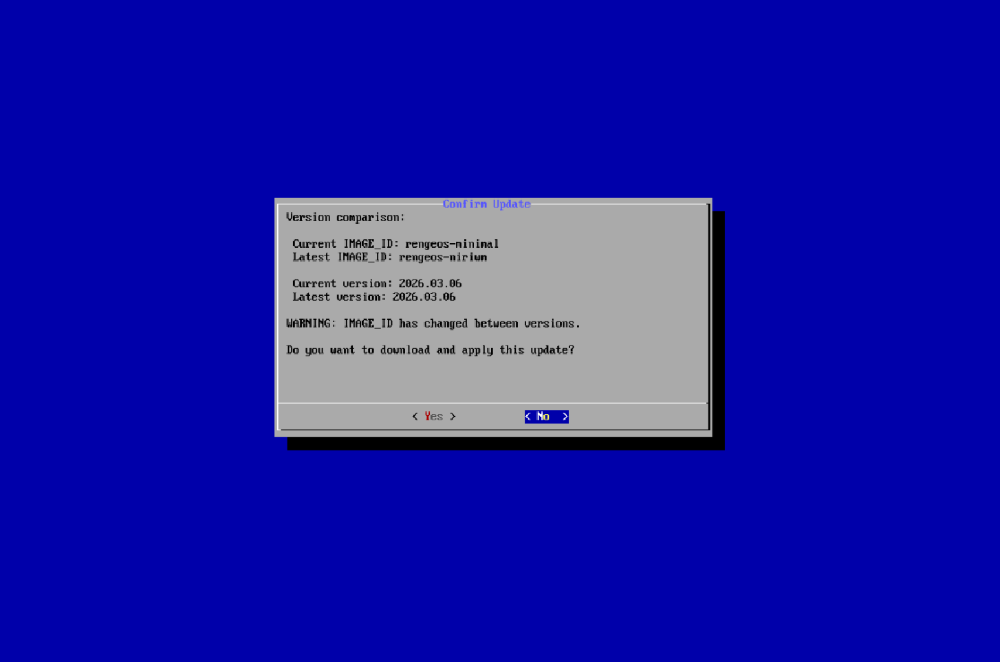
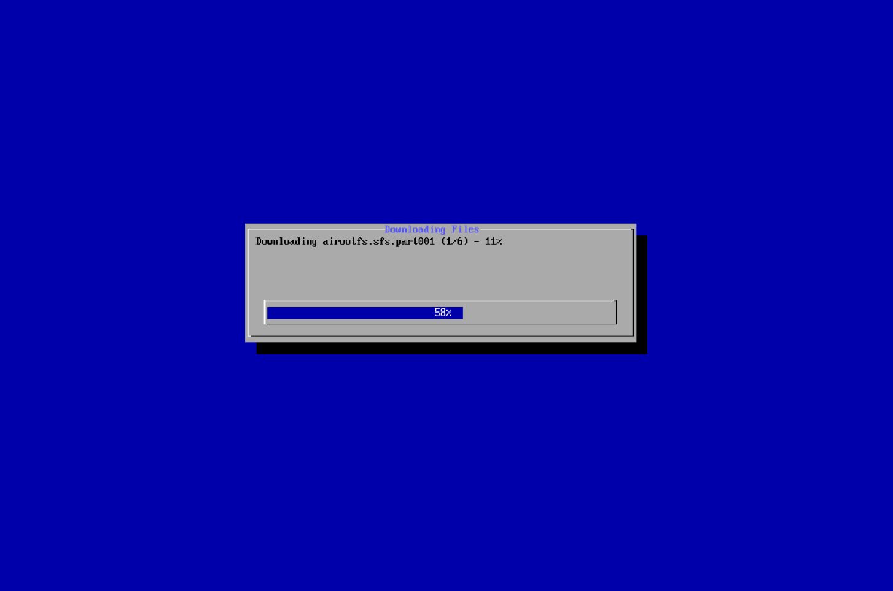
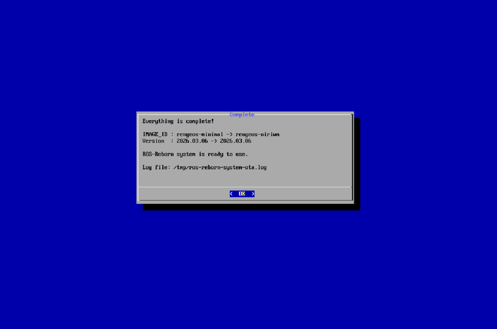

**Imagine** you're too lazy to download the latest **RengeOS ISO**, but your system is running **RengeOS** and ``Recovery Mode`` is **enabled**.
Why not take advantage of the ``ros-reborn`` tool?
 
**Essentially**, this is a supplementary tool to the ``ros-reborn`` tool that allows updating airootfs and the kernel in ``Recovery Mode`` based
on the latest **RengeOS Edition**.
 
**Thanks to this**, you will always save a lot of time installing the latest RengeOS and won't need a Live ISO or USB, which is also the purpose for which this tool was created:D

## Let’s proceed
import { Aside } from '@astrojs/starlight/components';

<Aside type="note">
**Note that** this process requires a **network connection**,
  so make sure you are connected to the network via **LAN** or **wirelessly** using the ``nmtui`` command.  
</Aside>

- **First**, boot into ``Recovery Mode`` from the ``GRUB menu``, then log in as the **root user**.
- **Then** enter the command ``ros-reborn-system-ota`` and you see this program.

## Check and compare versions

- **After confirmation**, we will begin comparing the current and latest versions (information is taken from GitHub).

- **Now** we need to choose a edition to compare and your choice will determine which version is downloaded and applied.

- **My choice here** is ``NiriWM-Edition`` because that's the edition I want to install using ``ros-reborn`` instead of ``Minimal-Edition`` i'm currently using:)

- **After** selecting ``NiriWM-Edition``, it will start downloading the ``os-release`` of that edition and then compare it with the current ``os-release``.

## Wait for the changes to be applied and completed

- **Once** we've confirmed, we'll wait for the download process to complete and apply the changes.

- **After** the changes have been implemented, we will summarize what has changed.

- **Now** you can use the ``ros-reborn`` tool to install and apply the edition you downloaded.

import { LinkCard } from '@astrojs/starlight/components';

<LinkCard title="ROS-Reborn (Recovery Mode)" href="/rengeos-docs/configuration/ros-reborn/" />
