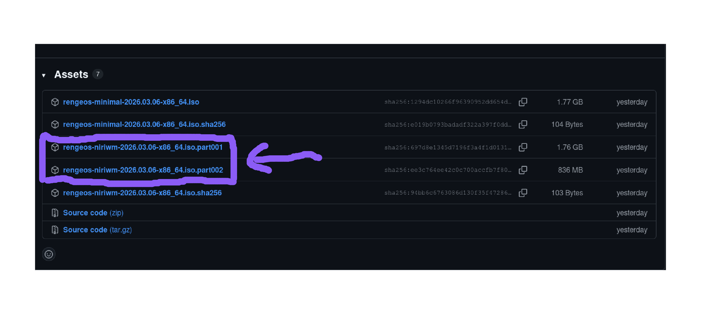

**First**, we have two ways to obtain an ISO file.
+ **If** you want the convenience of saving time on building, you can choose to download the ISO from hosting services.
+ **If** you want your **ISO** to always be **up-to-date**, you can choose to build it from source code.

## Obtain an ISO

import { Aside } from '@astrojs/starlight/components';

<Aside type="caution">
  **Each** edition you select and download corresponds to installing that edition on your system.
</Aside>

### RengeOS ISO (Minimal Edition)
**Last time the ISO was built:** ``2026-03-06``

import { Card, CardGrid } from '@astrojs/starlight/components';

<CardGrid>
  <Card title="SourceForge (Latest)" icon="cloud-download">
    Obtain an ISO here: <a href="https://sourceforge.net/projects/rengeos/files/RengeOS-ISO/Latest/Minimal-Edition/" target="_blank" rel="noopener noreferrer">Download</a>
  </Card>
  <Card title="Github Release (Latest)" icon="cloud-download">
    Obtain an ISO here: <a href="https://github.com/RengeOS/Source-ISO/releases/latest" target="_blank" rel="noopener noreferrer">Download</a>
  </Card>
</CardGrid>


<br/>

### RengeOS ISO (NiriWM Edition)
**Last time the ISO was built:** ``2026-03-06``

<CardGrid>
  <Card title="SourceForge (Latest)" icon="cloud-download">
    Obtain an ISO here: <a href="https://sourceforge.net/projects/rengeos/files/RengeOS-ISO/Latest/NiriWM-Edition/" target="_blank" rel="noopener noreferrer">Download</a>
  </Card>
  <Card title="Github Release (Latest)" icon="cloud-download">
    Obtain an ISO here: <a href="https://github.com/RengeOS/Source-ISO/releases/latest" target="_blank" rel="noopener noreferrer">Download</a>
    <span style="line-height:0.6;"></span>
    How to combine ISO: <a href="/rengeos-docs/getting-started/getting-an-iso/#download-from-github-and-combine-each-iso-part" rel="noopener noreferrer">Instruction</a>
  </Card>
</CardGrid>


<br/>

### Download from Github and combine each ISO part

<Aside type="note">
 - **I** did this on **Linux**, but it should work on **other operating systems** as well because I used ``cat`` to merge the parts into a complete ISO.
</Aside>

- **First**, you need to know which files we need to download to combine them into a complete ISO.
- **We** need to download the parts with the extension ``.iso.part001``, ``.iso.part002``, etc.



- **After** downloading, I've saved them in the ``~/Downloads/`` folder, and we'll combine them into a complete ISO.

```sh
# I need to move to the location where the downloaded parts are stored.
cd ~/Downloads/
# Now let's combine them.
cat rengeos-niriwm-2026.03.06-x86_64.iso.part* > rengeos-niriwm-2026.03.06-x86_64.iso
```
## Build it from source code (Arch-based)

<Aside type="caution">
  **Sometimes**, constant updates by the maintainer can make the ISO file unstable.
</Aside>

**Let's get started!**
### With RengeOS ISO (Minimal Edition)

+ **First**, you need to git clone this folder to your HOME directory.

```sh
# You can replace ~ with $HOME if you want.
cd ~ && git clone --branch minimal-iso https://github.com/RengeOS/Source-ISO && cd ~/Source-ISO/
```
+ **Then** run the ``build_iso`` script.

```sh
./build_iso
```
+ **After** the build process is complete, we will have the ISO file located in the ``out`` folder.
+ **Inside** the `out` folder, you will find the **ISO file** and the **SHA256 checksum file**.

---------------------------------
### With RengeOS ISO (NiriWM Edition)

+ **First**, you need to git clone this folder to your HOME directory.

```sh
# You can replace ~ with $HOME if you want.
cd ~ && git clone --branch niriwm-iso https://github.com/RengeOS/Source-ISO && cd ~/Source-ISO/
```
+ **Then** run the ``build_iso`` script.

```sh
./build_iso
```
+ **After** the build process is complete, we will have the ISO file located in the ``out`` folder.
+ **Inside** the `out` folder, you will find the **ISO file** and the **SHA256 checksum file**.

<br />
## Checksum ISO file (Recommend)

<Aside type="caution">
**Please ensure** you have the ``sha256sum`` package on **your distribution** before proceeding.
</Aside>

- **You** might be **wondering** **how to** ensure the integrity of an **ISO file** when it's downloaded.
- **Therefore**, we will perform an additional step to verify the integrity of the ISO by comparing the ISO with the SHA256 hash following the steps below:
+ **First**, **make sure** you have downloaded the **ISO file** and the **SHA256 ISO file** to the same folder before testing!

```sh
[test@rengeos ~]$ ls test/
rengeos-2026.01.29-x86_64.iso  rengeos-2026.01.29-x86_64.iso.sha256
```

+ **Now** we will proceed to checksum the files.
+ **Replace** it with the **SHA256 file** of the **ISO** you downloaded earlier, and here is an example:

```sh
[test@rengeos ~]$ cd test/ && sha256sum -c rengeos-2026.01.29-x86_64.iso.sha256
rengeos-2026.01.29-x86_64.iso: OK
```

+ **If** it says ``OK`` as above, then your **ISO** is definitely fine; otherwise, **I recommend** you download a new **ISO**.

import { LinkCard } from '@astrojs/starlight/components';

## After the ISO download process

- **After** the ISO download process is complete, you'll probably want to create a bootable USB drive.

<LinkCard title="Create Bootable USB" href="/rengeos-docs/getting-started/create-bootable-usb/" />
