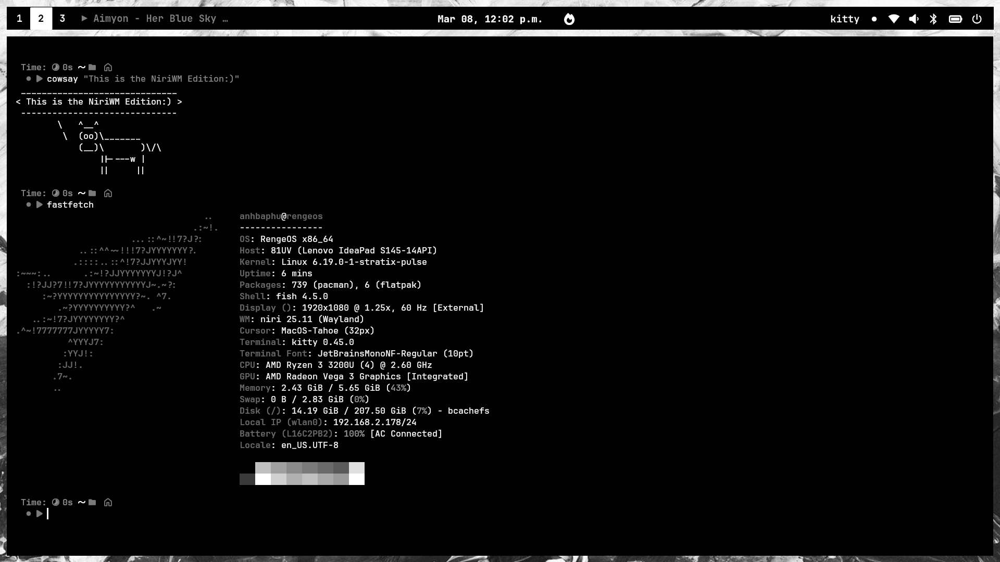
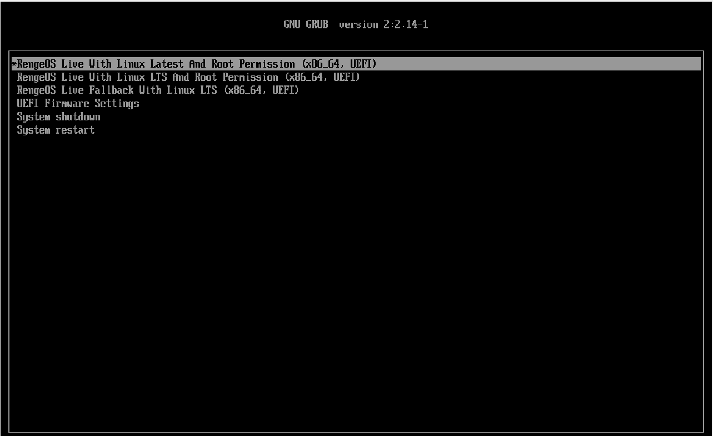
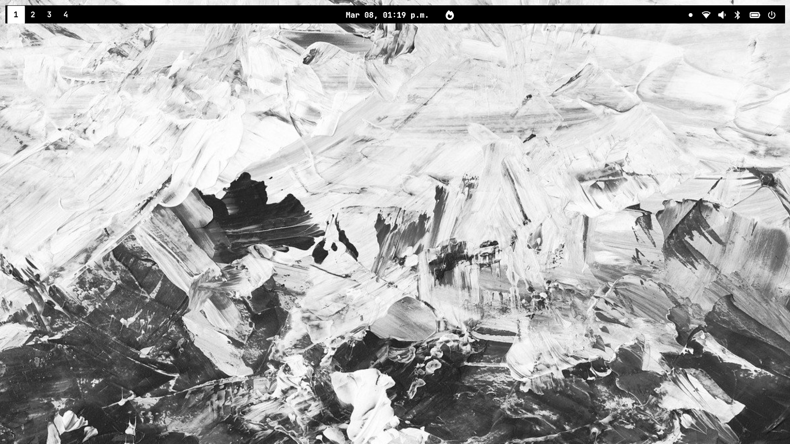
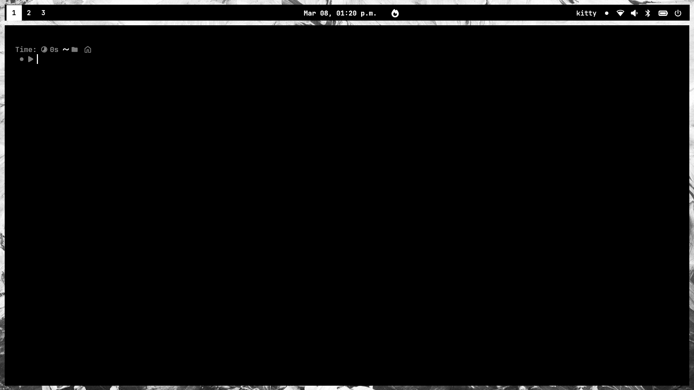
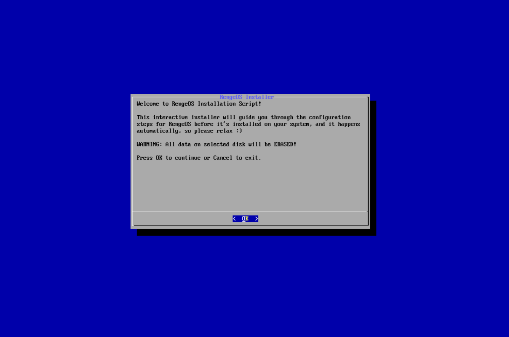

**Essentially**, we'll use ``ros-installer`` to automate the installation process from a Live ISO to the machine using the ``unsquashfs`` method and some other related techniques during the process.

import { Aside } from '@astrojs/starlight/components';

<Aside type="note">
  **Currently**, only **Offline Installation** is **supported**,
  and there are no plans to switch the installation process to online for the following reasons:
+ **Online Installation** can be quite risky if the network encounters problems during the installation process,
  such as installing a package, as restarting the process would be very inconvenient.
+ The **Online Installation** process is not compatible with the original design of this distribution (**RengeOS**).
+ Maintaining **other packages** and **infrastructure** using online methods would be quite expensive for me :(
</Aside>

+ **This** is what it will look like:



## Boot into Live ISO

<Aside type="caution">
  - **Make sure** you have disabled **Secure Boot** in your computer manufacturer's BIOS. **Otherwise**, it will **not boot**!
</Aside>

- **First**, we need to plug in the bootable USB drive containing the ISO file.
  Then, depending on your computer's hardware manufacturer,
  access the boot menu and boot from that USB drive.

- **Then** you will see the boot menu will look like this (UEFI). For Legacy BIOS, it will display similarly but with a slightly different interface.



<Aside type="tip">
  **If** you don't know what to choose, just select Linux Latest.
</Aside>

<Aside type="caution" title="Note">
``**If** you encounter a black screen error when selecting Linux Latest on Intel 10th generation chips (reported black screen issues), try selecting Linux LTS.
</Aside>

## Start the installation process
- **After** the systemd process is complete, you will see a screen like this and it is NiriWM



- **Now** we need to press the ``Win+Enter`` or ``Mod+Enter`` key combination to open the **kitty terminal**.



- **Next**, let's start the installation process with ``ros-installer``.

```sh
ros-installer
```
- **Immediately** after you run the installer, this interface will appear on the screen.



- **Now**, at this step, please follow these instructions below:

import { LinkCard } from '@astrojs/starlight/components';

<LinkCard title="Installation instructions" href="/rengeos-docs/installation/minimal-iso-installation/#choose-a-hard-drive-to-install-on" />

## After the installation process is complete

- **After** we have completed the installation process, please read the user guide here:

<LinkCard title="NiriWM Edition Configuration" href="/rengeos-docs/configuration/niriwm-edition" />